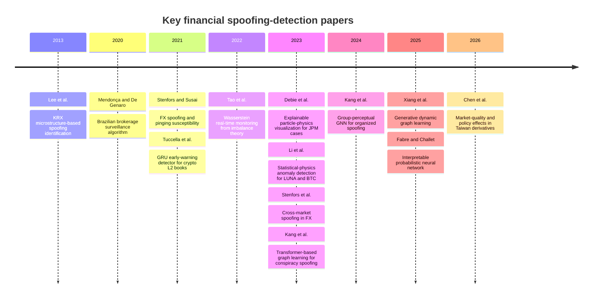
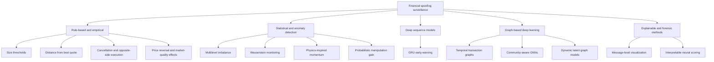
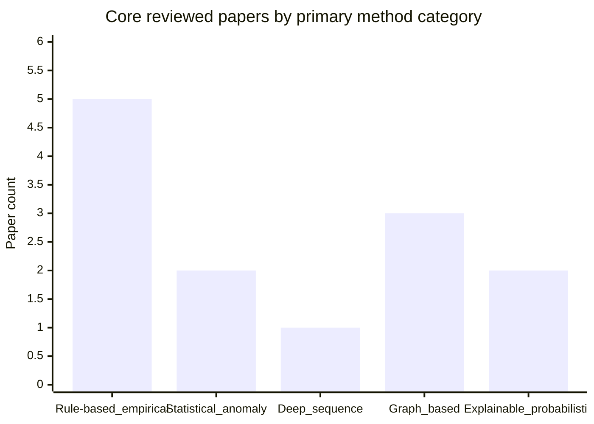

# Financial-Market Spoofing Detection Models and Methods

## Executive summary

Financial-market spoofing detection remains a small but rapidly maturing literature. The field began with **microstructure-driven empirical identification** of spoofing episodes in exchange data, especially in markets where visible order-book imbalance could be exploited, such as the Korea Exchange in Lee, Eom, and Park’s seminal 2013 study. Later work broadened the evidence base to Brazilian equities, FX spot markets, cryptocurrency venues, and Taiwan derivatives, and moved beyond descriptive identification toward **real-time surveillance**, **sequence models**, and **graph-based detection of coordinated spoofing rings**. citeturn34search0turn30search5turn21search6turn24search0turn29search4turn30search6turn39search2turn32search1turn40search0turn37search0turn17search0turn14search4turn22search2

Across the reviewed corpus, five broad methodological families dominate. First, **rule-based / empirical surveillance** methods define spoof-like patterns from order size, distance from the touch, cancellation timing, opposite-side execution, and market-quality effects. Second, **statistical and anomaly-oriented methods** rely on multilevel imbalance models, Wasserstein-distance monitoring, or physics-inspired momentum measures. Third, **deep sequence learning** appears in GRU-based early-warning models for crypto order books. Fourth, **graph-based deep learning** has become the most active recent line, especially for detecting **conspiracy spoofing** or organized, multi-actor manipulation. Fifth, a smaller line develops **explainable and forensic tools**, such as particle-physics visual analytics and interpretable probabilistic neural networks. citeturn34search0turn30search5turn25search6turn29search4turn39search2turn32search1turn37search0turn17search0turn14search4turn22search2

The strongest empirical lessons are surprisingly consistent across domains. Spoofing signals are most visible when there is **large, aggressive, low-execution-probability quoting**, **book imbalance**, **abnormal cancellation**, **short-horizon price reversal**, and **opposite-side profit-taking**. Manipulation is often more effective in **less liquid contracts**, at **market open/close**, or when venues disclose enough book state for other traders or algorithms to react. In peer-reviewed studies, spoofing is also associated with **temporary price impact**, **wider spreads**, **higher short-run volatility**, and **lower depth**, which means that detection and market-quality measurement are tightly linked. citeturn34search0turn30search5turn21search6turn30search6turn40search0turn29search4turn39search2

The literature is improving methodologically, but it still has major weaknesses. Many papers rely on **private proprietary exchange data**, hand-labeled or rule-labeled events, and heavily engineered definitions of suspicious orders. Comparable open benchmarks are rare. Several promising papers are available only as **arXiv preprints** rather than archival peer-reviewed versions, and many do not report the full set of confusion-matrix metrics or cross-market robustness checks. The most reproducible work tends to sit at two ends of the spectrum: either transparent empirical papers with clearly described order-book rules, or machine-learning papers that at least disclose benchmark metrics, ablations, and deployment setups. citeturn30search5turn24search0turn25search6turn29search4turn37search0turn17search0turn14search4turn22search2turn40search0

## Corpus and taxonomy

This review applies the user’s scope strictly: it includes only **peer-reviewed journal or conference papers** and **arXiv papers** on **financial-market spoofing and closely related order-book manipulation strategies**. I emphasize publisher pages when available; when a paper exists both as arXiv and in peer-reviewed form, I cite the peer-reviewed version. Papers available only on SSRN were not treated as core evidence for the main comparative synthesis. citeturn34search0turn30search5turn21search6turn29search4turn39search2turn32search1turn17search0turn20search6turn14search4turn22search2turn40search0

The reviewed core papers fall into these categories: **rule-based / empirical surveillance**, **statistical or anomaly detection**, **classical or probabilistic machine learning**, **deep sequence learning**, **graph-based deep learning**, and **explainable / forensic methods**. I did **not** find a mature financial-spoofing subliterature on **adversarial robustness** or **multimodal spoofing detection** comparable to what exists in biometrics or cyber-physical systems; in this corpus, robustness is usually addressed indirectly through out-of-sample case tests, early-warning design, or deployment studies rather than through explicit adversarial training. citeturn29search4turn28search1turn24search0turn17search0turn14search4turn40search0

A useful way to read the literature is to separate papers that aim to **identify probable spoofing events** from papers that aim to **understand why spoofing is feasible** or **how spoofing degrades market quality**. The first group is closer to surveillance engineering; the second supplies the causal and microstructural context used to choose features and thresholds. In practice, the most persuasive detection papers are those that connect identification rules to short-horizon reversals, cancellation patterns, or exogenous policy changes, because intent is not directly observable in market data. citeturn34search0turn30search5turn29search4turn30search6turn40search0

## Rule-based and empirical surveillance methods

**Lee, Eom, and Park (2013)** is the foundational spoofing paper in this area. The problem definition is explicit: identify traders who place large, low-execution-probability orders to create misleading order-book imbalance and then profit from opposite-side trading. The dataset is unusually rich: complete intraday order and trade data for 549 KRX-listed firms over 78 trading days around a market-design change, with account-level identification. The paper’s method is largely **rule-based and empirical**. A spoofing order is defined using size and price-distance thresholds, followed by opposite-side trading and later withdrawal. Features are microstructure-native: order size relative to average size, distance from the market, timing of subsequent opposite-side orders, trader type, and firm characteristics. Metrics are mostly descriptive rather than classification-oriented. The paper reports that about **0.81% of total orders** matched the spoofing definition before the disclosure-rule change, the average spoofing-buy order was **5.6 times** larger than a typical buy order, and nearly **90%** were priced more than **10 ticks** away from the best bid, implying very low execution probability. Strengths are the account-level data and natural experiment; limitations are the dependence on a market-specific order-disclosure rule and a hand-crafted spoofing definition rather than a trainable detector. Source link: publisher page. citeturn34search0turn34search3

**Mendonça and De Genaro (2020)** takes a more practical compliance angle. The problem is to detect potential spoofing cases in Brazilian equities using reconstructed order books from intraday order flow. The dataset covers **ten Ibovespa stocks** from a brokerage-firm data source; exact time range and full sample size are not specified in the abstract material available. The method is an **algorithmic surveillance procedure** based on order-book reconstruction and rule-based filters for suspicious patterns. Exact classifier metrics are unspecified in the accessible sources, but the paper reports **six possible cases**, all concentrated near the **beginning or end of the trading session**, and finds that less liquid stocks required larger spoof orders to narrow wider spreads. Its main strength is practical deployability for broker surveillance; its main limitation is the absence of open benchmark-style evaluation metrics in the public summary. Source link: publisher page. citeturn30search5turn30search0

**Stenfors and Susai (2021)** extends spoofing analysis to OTC-style FX electronic trading and pairs it with the related tactic of **pinging**. The dataset is unusually detailed for FX: a complete EBS limit-order-book sample spanning **2,330,480 limit-order submissions and cancellations** worth more than **$3 trillion** across five FX pairs from **8–13 September 2010**. The method is an **empirical microstructure model** centered on order **price aggressiveness** and subsequent reaction patterns. It is not a classifier in the supervised-ML sense, so standard AUC/F1 metrics are not central; the main results are economic and statistical findings. The paper finds that **EUR/USD and USD/JPY** are especially sensitive to information-rich orders, implying higher susceptibility to spoofing, while pinging appears more prevalent in more illiquid or secondary-platform markets such as **EUR/SEK** and **USD/RUB**. A major strength is the full-book FX dataset; a limitation is that the method identifies susceptibility and potential pathways rather than directly labeling individual spoof orders with benchmark detection metrics. Source link: publisher page. citeturn30search2turn21search6

**Stenfors, Doraghi, Soviany, Susai, and Vakili (2023)** asks whether spoofing can be executed **across related markets**, not just within a single instrument. Using EBS Level 5.0 data for **EUR/USD, USD/JPY, and EUR/JPY** from **1 October 2013 to 28 February 2015** with **100 ms** snapshots and up to **10 depth levels**, the paper decomposes a cross-market spoof event into a spoof order in one market and a genuine resting order in another related market. The method is again empirical rather than supervised: it estimates whether aggressive, sizeable limit-order events in one book predict favorable fills in another. The principal result is that **EUR/JPY** can provide a viable cross-market channel through deeper spoof orders in **EUR/USD** or **USD/JPY**, and that spoof orders are more likely in **liquid hedging markets** while genuine resting orders are more likely in **less liquid related markets**. Strengths include a genuinely new surveillance problem and rich cross-market book data; limitations include the lack of event-level ground truth and conventional classifier metrics. Source link: publisher page. citeturn7search0turn30search6

**Chen, Hsieh, and Yang (2026)** is the current state of the art in empirical market-quality analysis of spoofing. The problem is not merely to flag suspicious order revisions, but to estimate how potential spoofing affects **trade prices, imbalance, spreads, volatility, and depth**, and whether policy can reduce those effects. The dataset is comprehensive millisecond-level order and trade data from Taiwan derivatives markets, linking orders, revisions, and executions. The method identifies **aggressive limit-order revisions** that are followed by opposite-side executions and then studies price impact, reversals, and market quality, with a **triple-difference quasi-natural experiment** around the **Dynamic Price Banding Mechanism**. Reported results are economically precise: the positive price impact is **more than twice as large in options as in futures**, and the DPBM reduces trade distance by **0.45%** for the relevant high-order-distance group in TAIEX futures relative to controls; the paper also reports wider spreads, higher tick-return volatility, and lower depth after identified spoofing events. Strengths are the policy design and linked order-execution data; limitations are that this is still identification of **potential** spoofing, not legally verified intent. Source link: publisher page. citeturn40search0turn40search3

## Statistical, anomaly, and explainable methods

**Tao, Day, Ling, and Drapeau (2022)** develops a more formal microstructural detector. The problem is real-time spoofing surveillance in high-frequency limit-order-book data. The dataset is **Level 2 TMX data**; exact market span is not specified in the public abstracts, but the paper calibrates a multilevel imbalance model on real TMX order-book data. The method defines a **multilevel imbalance** measure, derives the **optimal spoofing strategy** under that imbalance structure, and then uses **Wasserstein-distance-based monitoring procedures** for online detection. Evaluation is not presented as a standard classification benchmark in the public summary; instead, the contribution is a theoretical detector calibrated on real data and a real-time monitoring protocol. The paper’s strength is the tight integration of market microstructure theory and surveillance design; the limitation is limited availability of public benchmark metrics such as AUC/F1 in the accessible material. Source link: publisher page. citeturn29search4turn29search0

**Li, Polukarova, and Ventre (2023)** introduces a **statistical-physics** perspective. The problem is to detect spoofing and layering from order-book dynamics, especially in crypto markets where open order-book data and manipulation concerns are both acute. The method models the order book as moving particles and defines a **momentum measure** summarizing state and dynamics. The datasets include **LUNA** during its flash crash and **Bitcoin** order-book data; exact sample sizes are unspecified in the public sources. The main reported result is comparative: the method **outperforms a conventional Z-score-based anomaly detector** in identifying manipulation across both LUNA and Bitcoin. Its strength is conceptual novelty and cross-asset anomaly detection; its weakness is that publicly accessible summaries do not expose the paper’s exact benchmark values. Source link: peer-reviewed conference page. citeturn39search2turn39search0

**Debie et al. (2023)** belongs in an **explainable / forensic** category rather than standard predictive modeling. It studies the **JPMorgan spoofing cases** in metals and Treasury futures—markets where regulatory findings already established misconduct—and uses **CERN-inspired particle-physics visualization** on exchange message data rather than time-sliced snapshots. The data source is **CME Group** message-level data for the prosecuted cases. There is no classifier AUC or F1 because the contribution is forensic reconstruction and interpretability. The method allows simultaneous inspection of multiple manipulation indicators, revealing staircase execution patterns and offering an alternative motivation for spoofing beyond simply moving prices. The strengths are interpretability and post hoc forensic value; the limitation is that it is better suited for investigation and explanation than for a production low-latency detector. Source link: peer-reviewed journal page. citeturn32search1turn32search3

**Fabre and Challet (2025)** bridges explainability and online modeling. The problem is **real-time spoofability estimation** in a centralized cryptocurrency limit order book. Using Level-3 data, the paper introduces **multi-scale Hawkes-process-inspired order-flow variables** that encode both **order size** and **posting distance** from the best quotes, then trains a simple **probabilistic neural network** to predict the conditional distribution of mid-price moves. In the paper’s spoofing framework, these forecasts are converted into a **probabilistic manipulation gain**. The public summaries report one headline result: over **2024-12-04 to 2024-12-07**, about **31% of large orders** in the analyzed sample could plausibly spoof the market under the model. Strengths are interpretability, explicit market-manipulation-gain modeling, and real-time feasibility; limitations are that the paper is still an arXiv preprint and the accessible summaries do not expose full benchmark tables. Source link: arXiv page. citeturn22search2turn38search0

## Machine learning, deep learning, and graph methods

**Tuccella, Nadler, and Șerban (2021)** is the clearest **deep sequence-learning** detector in the review. The paper formulates spoofing detection as an **early-warning classification** problem in cryptocurrency order books. The raw data are Level-2 book data for pairs such as **BTC/USD, DAI/USD, and BTC/DAI** from **Bitfinex and Kraken**, collected from **November 2019 to May 2020** at millisecond frequency, totaling **337 GB** of uncompressed data. The actual labeled evaluation set consists of **four annotated samples**, each capturing a different manipulation style. Features include current bid-ask, delta volume, price of the updated level, volatility, cumulative bid volume, and cumulative ask volume. Training/validation/test splits are **65/15/20** within each sample; a second experiment concatenates all training and validation sets and tests on each sample separately. The model is a **GRU-based detector**. In the main early-warning experiment, average **FP = 0.35**, **FN = 0.16**, and **accuracy = 0.75**, with the best sample nearing **0.88** accuracy; the authors emphasize that the model can often detect manipulation about **two seconds before it ends**. Strengths are temporal modeling and early-warning framing; limitations are the tiny labeled corpus, synthetic or rule-based annotation pipeline, and notable instability across sample types. Source link: arXiv page. citeturn24search0turn25search6turn26search5

**Kang, Mu, and Ning (2023)** is an early **graph-based deep learning** paper focused on **conspiracy spoofing**, meaning coordinated manipulation by multiple linked actors rather than isolated suspicious orders. The dataset is described as a **real-world market from one of the largest exchanges in East Asia**, but public summaries do not specify size or time range. The model builds a **temporal transaction graph layer** and uses a **transformer-based graph architecture** to learn sequential and relational representations jointly in an end-to-end fashion. Publicly accessible sources confirm that the method substantially outperformed ten baselines, but exact original paper metrics are not exposed in the accessible summaries, so they should be marked **unspecified** here. The strength is conceptual: spoofing surveillance moves from event-level rule triggers to actor-relationship learning. The main limitation is reproducibility, because the dataset and public metrics remain thinly documented outside the paper itself. Source link: peer-reviewed conference page. citeturn37search0turn37search1

**Kang, Mu, and Ning (2024)** follows with **GPEGNN**, a graph neural network for **organized spoofing transactions**. The method constructs user trading behavior into transaction graphs, learns node- and edge-level local context via graph attention and self-attention modules, and adds a **community-centric encoder** to capture group-level features. The public summary indicates evaluation in a **commodity futures exchange** setting, but the original paper’s exact dataset size and public benchmark values are not exposed in accessible sources. Therefore the exact results are best marked **unspecified** in a strict review, although later work re-benchmarking the same family of models shows it to be competitive. Strengths are explicit group-level context and movement toward industrial deployment; limitations are again data opacity and limited public reporting. Source link: peer-reviewed conference page. citeturn19search29turn20search6

**Xiang et al. (2025)** introduces **GDGM**, one of the most complete graph-based spoofing papers available from public summaries. The problem remains conspiracy spoofing detection under **dynamic, irregular, and evolving graph structure**. The paper uses a custom **Spoofing Detection Dataset** with **40,072 records**. Labels are based on trader-reported cases verified by financial domain experts; irrelevant identifiers are removed, features are normalized on train-set statistics, and transactions are connected as graph nodes using a **date-based sliding window**. The model combines **neural ODEs**, **GRUs**, heterogeneous graph aggregation, and **pseudo-label generation**. It reports a full benchmark suite: **AUC 0.9029**, **accuracy 0.8701**, **F1 0.8002**, **precision 0.8508**, **recall 0.7702**, outperforming the best reported baseline (**RTG-Trans**) by **0.31% AUC** and **2.4% accuracy**; the paper also includes ablations and a **12-week deployment study**. Strengths are dynamic-graph modeling, detailed metrics, and deployment evidence; limitations are that the paper is currently available as a preprint / web-posted PDF and still depends on a proprietary surveillance dataset. Source link: ACM WWW paper / public PDF snippet. citeturn14search4turn37search26turn12search12

## Comparative synthesis

The comparative pattern is clear. **Rule-based and empirical papers** remain strong when the goal is legally interpretable surveillance, case reconstruction, or policy evaluation. **Statistical and anomaly methods** add theory-grounded online monitoring but often under-report standard ML metrics. **Deep sequence models** offer early-warning capability in event streams, while **graph-based models** are the most promising direction for detecting coordinated manipulation and relational concealment. **Explainable / forensic methods** remain indispensable for investigator trust and enforcement workflow, especially when intent must be argued carefully. citeturn34search0turn30search5turn29search4turn24search0turn37search0turn17search0turn14search4turn32search1

### Comparative table

| Citation key | Year | Venue | Domain | Method category | Dataset | Metrics | Main performance |
|---|---:|---|---|---|---|---|---|
| Lee2013 citeturn34search0turn34search3 | 2013 | *Journal of Financial Markets* | KRX equities | Rule-based / empirical | 549 KRX firms; 78 trading days; Nov 2001–Feb 2002 | Descriptive empirical metrics | ~0.81% of total orders fit spoofing definition before rule change; spoofing-buy orders 5.6× typical buy size; nearly 90% >10 ticks away from best bid |
| Mendonca2020 citeturn30search5turn30search0 | 2020 | *Journal of Financial Regulation and Compliance* | Brazilian equities | Rule-based / empirical | Ten Ibovespa stocks; brokerage order-flow data; size/time range unspecified | Unspecified | Six possible cases; clustered near open/close; larger spoof orders needed in less liquid stocks |
| StenforsSusai2021 citeturn30search2turn21search6 | 2021 | *J. of International Financial Markets, Institutions and Money* | FX spot | Empirical / statistical | 2,330,480 EBS order submissions/cancellations; >$3T; 8–13 Sep 2010; 5 FX pairs | Economic/statistical significance; no AUC reported | EUR/USD and USD/JPY most sensitive to spoof-like orders; pinging more prevalent in illiquid/secondary markets |
| Tuccella2021 citeturn24search0turn25search6turn26search5 | 2021 | arXiv | Crypto order books | Deep learning / GRU | 337 GB L2 crypto data; Bitfinex and Kraken; Nov 2019–May 2020; 4 annotated samples | FP, FN, Accuracy | Average FP 0.35, FN 0.16, accuracy 0.75; detects manipulations about 2 seconds before their end |
| Tao2022 citeturn29search4turn29search0 | 2022 | *Quantitative Finance* | TMX order books | Statistical / anomaly | TMX L2 data; exact size/range unspecified | Unspecified in accessible summaries | Real-time Wasserstein monitoring calibrated from multilevel imbalance and optimal-spoofer model |
| Debie2023 citeturn32search1turn32search3 | 2023 | *European Financial Management* | Treasury & metals futures | Explainable / forensic | CME Group message data from JPMorgan spoofing cases; 2008–2016 case window | No classifier metrics | Forensic visualization reconstructs spoofing sequences and staircase execution patterns; improves interpretability |
| Li2023 citeturn39search2turn39search0 | 2023 | *ICAIF* | Crypto LOBs | Statistical physics / anomaly | LUNA flash-crash and Bitcoin data; exact size unspecified | Comparative anomaly-detection performance | Outperforms Z-score-based anomaly detection in identifying manipulation across LUNA and Bitcoin |
| StenforsEtAl2023 citeturn7search0turn30search6 | 2023 | *J. of International Financial Markets, Institutions and Money* | FX cross-market | Empirical / cross-market statistical | EBS Level 5.0; EUR/USD, USD/JPY, EUR/JPY; Oct 2013–Feb 2015; 100 ms, 10 depths | Economic/statistical significance | Finds viable EUR/JPY cross-market spoofing pathway; spoof orders more likely in hedging/liquid markets |
| Kang2023 citeturn37search0turn37search1 | 2023 | *ADMA* | East Asian exchange | Graph-based deep learning | Real-world exchange dataset; exact size/range unspecified | Unspecified | Transformer-based temporal graph model reported to outperform 10 baselines; exact public metrics unspecified |
| Kang2024 citeturn19search29turn20search6 | 2024 | *ECML PKDD ADS Track* | Commodity futures | Graph-based deep learning | Commodity futures exchange scenario; size/range unspecified | Unspecified | GPEGNN adds community-centric group features for organized spoofing detection; exact public metrics unspecified |
| Xiang2025 citeturn14search4turn37search26turn12search12 | 2025 | *WWW* | Financial spoofing transactions | Dynamic graph learning | 40,072 records; expert-verified labels; proprietary dataset | AUC, Accuracy, F1, Precision, Recall | AUC 0.9029; Acc 0.8701; F1 0.8002; Prec 0.8508; Rec 0.7702 |
| FabreChallet2025 citeturn22search2turn38search0 | 2025 | arXiv | Centralized crypto exchange | Explainable / probabilistic deep learning | Level-3 crypto LOB; 2024-12-04 to 2024-12-07 evaluation window for large orders | Spoofability rate; benchmark tables unspecified in public summary | 31% of large orders in the evaluated window could spoof the market under the model |
| Chen2026 citeturn40search0turn40search3 | 2026 | *Pacific-Basin Finance Journal* | Taiwan derivatives | Empirical / quasi-experimental | Complete millisecond order and trade data; futures and options; Taiwan derivatives market | Trade distance, spread, volatility, depth; no AUC | Positive option price impact >2× futures; DPBM lowers trade distance by 0.45% for treated high-distance group and improves market quality |

### Timeline of key papers



### Flowchart of method categories



### Bar chart of papers by method category



## Critical analysis

A first major trend is the shift from **single-order heuristics** to **structure-aware detection**. Early papers treated spoofing as a stylized sequence: place a large distant order, create an imbalance signal, trade on the opposite side, then cancel. That logic remains useful, but newer work acknowledges that modern spoofing can be **multi-actor**, **cross-market**, or **dynamically adaptive**, which explains the recent rise of graph learning and more formal anomaly measures. citeturn34search0turn30search5turn29search4turn7search0turn37search0turn17search0turn14search4

A second trend is that the literature increasingly treats spoofing detection as inseparable from **market-quality analysis**. Chen et al. show that potential spoofing produces temporary price impact, reversal, wider spreads, higher volatility, and lower depth, while older FX and KRX papers similarly connect spoofing feasibility to transparency and liquidity structure. This matters because one of the hardest problems in surveillance is distinguishing informative but canceled liquidity provision from deceptive order flow. The more a paper can show **short-lived price concession plus reversal plus opposite-side gain**, the more convincing its detection logic becomes. citeturn40search0turn30search2turn34search0

The largest reproducibility gap is **data access**. Many of the strongest papers rely on complete order-message feeds, account-level identifiers, or exchange-owned labeled cases. KRX account-level data, EBS full-book FX data, TMX L2 data, Taiwan derivatives order-linkage data, and the proprietary East-Asian exchange datasets used for graph learning are not open public benchmarks. As a result, researchers often cannot replicate exact detection pipelines, compare detectors fairly, or test cross-market generalization. citeturn34search0turn30search2turn29search4turn30search6turn40search0turn37search0turn19search29turn14search4

A second reproducibility issue is **labeling**. Some papers use prosecuted or expert-verified cases, some use rule-generated suspicious events, and some effectively measure market **susceptibility** rather than true manipulation. That means reported performance numbers are often not directly comparable. A model trained on heuristic labels may achieve high AUC against those labels while still diverging from what a regulator or court would regard as spoofing. This is especially important for GRU and graph models trained on narrow proprietary labels or event definitions. citeturn25search6turn29search4turn14search4turn22search2turn40search0

Dataset bias also appears in **venue design** and **liquidity regime**. Lee et al. show spoofing prevalence fell sharply after a KRX disclosure-rule change, which means detectors trained under one transparency regime may fail under another. FX papers show that spoofing and pinging opportunities vary strongly across major versus secondary venues. Chen et al. find larger spoofing effects in options than futures and especially in illiquid or out-of-the-money contracts. These results imply that “spoofing detection” is not a single stable task; it is partly a function of **market microstructure, venue rules, and participant attention models**. citeturn34search0turn30search2turn30search6turn40search0

Evaluation practice is still uneven. Some graph papers provide full AUC, accuracy, F1, precision, recall, ablations, and deployment studies; others only state that they outperform baselines. Empirical papers often offer stronger economic validation but weaker ML-style metrics. Future work would benefit from a standard protocol with **event-level and actor-level labels**, **chronological train/validation/test splits**, **cross-venue transfer tests**, **precision-recall curves for imbalanced data**, and **cost-sensitive metrics** that reflect surveillance reality, where false positives create analyst burden and false negatives create legal and market-integrity risk. citeturn14search4turn37search26turn37search0turn40search0turn25search6

The most important open questions are practical. How should detectors adapt when spoofers learn the detector’s thresholds or graph signatures? How can order-book surveillance be made **cross-venue**, especially when genuine orders and spoof orders may be split across related markets? How much of current high-performing graph learning is truly learning manipulation, versus learning exchange- or participant-specific idiosyncrasies? And how should explanation be integrated so that a graph or neural alert can be defended in an enforcement setting? The reviewed literature suggests that the best next step is not a single better architecture, but a combination of **microstructure-grounded features**, **chronological out-of-sample testing**, **graph/sequence modeling for coordination**, and **forensic explainability**. citeturn7search0turn29search4turn32search1turn14search4turn22search2turn40search0

## BibTeX entries

```bibtex
@article{LeeEomPark2013,
  author = {Lee, Eun Jung and Eom, Kyong Shik and Park, Kyung Suh},
  title = {Microstructure-based manipulation: Strategic behavior and performance of spoofing traders},
  journal = {Journal of Financial Markets},
  volume = {16},
  number = {2},
  pages = {227--252},
  year = {2013},
  doi = {10.1016/j.finmar.2012.05.004}
}
```
Source link: publisher page. citeturn34search0turn34search3

```bibtex
@article{MendoncaDeGenaro2020,
  author = {Mendonça, Luisa and De Genaro, Alan},
  title = {Detection and analysis of occurrences of spoofing in the Brazilian capital market},
  journal = {Journal of Financial Regulation and Compliance},
  volume = {28},
  number = {3},
  pages = {369--408},
  year = {2020},
  doi = {10.1108/JFRC-07-2019-0092}
}
```
Source link: publisher page. citeturn30search5turn30search0

```bibtex
@article{StenforsSusai2021,
  author = {Stenfors, Alexis and Susai, Masayuki},
  title = {Spoofing and pinging in foreign exchange markets},
  journal = {Journal of International Financial Markets, Institutions and Money},
  volume = {70},
  pages = {101278},
  year = {2021},
  doi = {10.1016/j.intfin.2020.101278}
}
```
Source link: publisher page. citeturn30search2turn21search6

```bibtex
@article{TuccellaNadlerSerban2021,
  author = {Tuccella, Jean-No{\"e}l and Nadler, Philip and {\c{S}}erban, Ovidiu},
  title = {Protecting Retail Investors from Order Book Spoofing using a GRU-based Detection Model},
  journal = {arXiv preprint arXiv:2110.03687},
  year = {2021},
  eprint = {2110.03687},
  archivePrefix = {arXiv},
  primaryClass = {q-fin.ST}
}
```
Source link: arXiv page. citeturn24search0turn26search5

```bibtex
@article{TaoDayLingDrapeau2022,
  author = {Tao, Xuan and Day, Andrew and Ling, Lan and Drapeau, Samuel},
  title = {On detecting spoofing strategies in high-frequency trading},
  journal = {Quantitative Finance},
  volume = {22},
  number = {8},
  pages = {1405--1425},
  year = {2022},
  doi = {10.1080/14697688.2022.2059390}
}
```
Source link: publisher page. citeturn29search4turn29search0

```bibtex
@article{DebieEtAl2023,
  author = {Debie, Philippe and Gardebroek, Cornelis and Hageboeck, Stephan and van Leeuwen, Paul and Moneta, Lorenzo and Naumann, Axel and Pennings, Joost M. E. and Trujillo-Barrera, Andres A. and Verhulst, Marjolein E.},
  title = {Unravelling the JPMorgan spoofing case using particle physics visualization methods},
  journal = {European Financial Management},
  volume = {29},
  number = {1},
  pages = {288--326},
  year = {2023},
  doi = {10.1111/eufm.12353}
}
```
Source link: publisher page. citeturn32search1turn32search3

```bibtex
@inproceedings{LiPolukarovaVentre2023,
  author = {Li, Haochen and Polukarova, Maria and Ventre, Carmine},
  title = {Detecting Financial Market Manipulation with Statistical Physics Tools},
  booktitle = {Proceedings of the 4th ACM International Conference on AI in Finance},
  pages = {565--573},
  year = {2023},
  doi = {10.1145/3604237.3626871}
}
```
Source link: publisher page. citeturn39search2turn39search0

```bibtex
@article{StenforsEtAl2023,
  author = {Stenfors, Alexis and Doraghi, Mehrdaad and Soviany, Cristina and Susai, Masayuki and Vakili, Kaveh},
  title = {Cross-market spoofing},
  journal = {Journal of International Financial Markets, Institutions and Money},
  volume = {83},
  pages = {101735},
  year = {2023},
  doi = {10.1016/j.intfin.2023.101735}
}
```
Source link: publisher page. citeturn7search0turn30search6

```bibtex
@inproceedings{KangMuNing2023,
  author = {Kang, Le and Mu, Tai-Jiang and Ning, Xiaodong},
  title = {Conspiracy Spoofing Orders Detection with Transformer-Based Deep Graph Learning},
  booktitle = {Advanced Data Mining and Applications},
  series = {Lecture Notes in Computer Science},
  pages = {489--503},
  year = {2023},
  doi = {10.1007/978-3-031-46664-9_33}
}
```
Source link: publisher page. citeturn37search1turn37search0

```bibtex
@inproceedings{KangMuNing2024,
  author = {Kang, Le and Mu, Tai-Jiang and Ning, XiaoDong},
  title = {Spoofing Transaction Detection with Group Perceptual Enhanced Graph Neural Network},
  booktitle = {Machine Learning and Knowledge Discovery in Databases. Applied Data Science Track},
  series = {Lecture Notes in Computer Science},
  pages = {106--122},
  year = {2024},
  doi = {10.1007/978-3-031-74922-3_7}
}
```
Source link: publisher page. citeturn20search6turn19search29

```bibtex
@inproceedings{XiangEtAl2025,
  author = {Xiang, Sheng and Jiang, Yidong and Chen, Yunting and Cheng, Dawei and Zhao, Guoping and Jiang, Changjun},
  title = {Generative Dynamic Graph Representation Learning for Conspiracy Spoofing Detection},
  booktitle = {Proceedings of the ACM Web Conference 2025},
  year = {2025},
  doi = {10.1145/3696410.3714518}
}
```
Source link: public PDF / conference page. citeturn12search12turn14search4

```bibtex
@article{FabreChallet2025,
  author = {Fabre, Timoth{\'e}e and Challet, Damien},
  title = {Learning the Spoofability of Limit Order Books With Interpretable Probabilistic Neural Networks},
  journal = {arXiv preprint arXiv:2504.15908},
  year = {2025},
  eprint = {2504.15908},
  archivePrefix = {arXiv},
  primaryClass = {q-fin.TR}
}
```
Source link: arXiv page. citeturn22search2turn38search0

```bibtex
@article{ChenHsiehYang2026,
  author = {Chen, Jianqiang and Hsieh, Pei-Fang and Yang, J. Jimmy},
  title = {Order spoofing, price impact, and market quality},
  journal = {Pacific-Basin Finance Journal},
  volume = {97},
  pages = {103077},
  year = {2026},
  doi = {10.1016/j.pacfin.2026.103077}
}
```
Source link: publisher page. citeturn40search0turn40search3